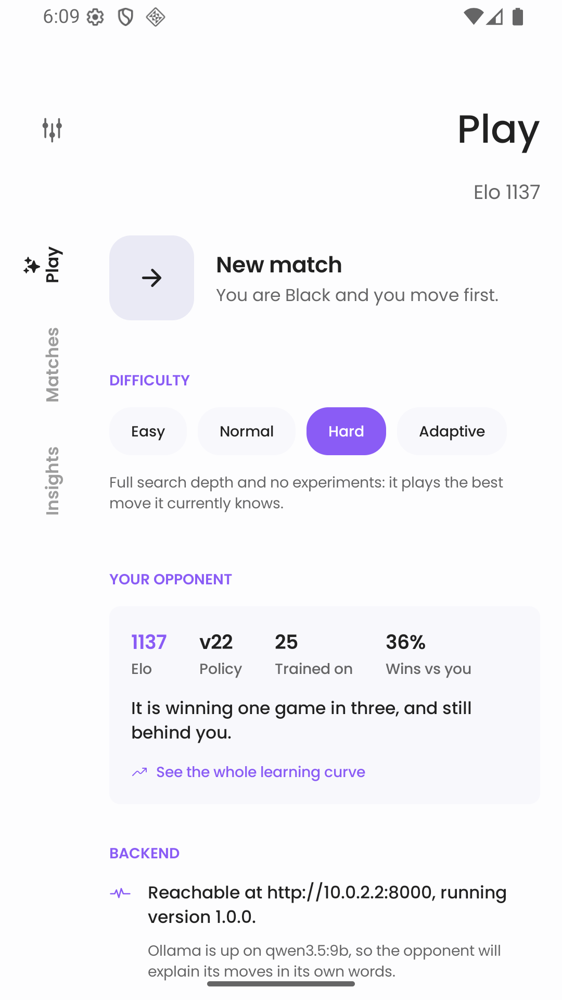
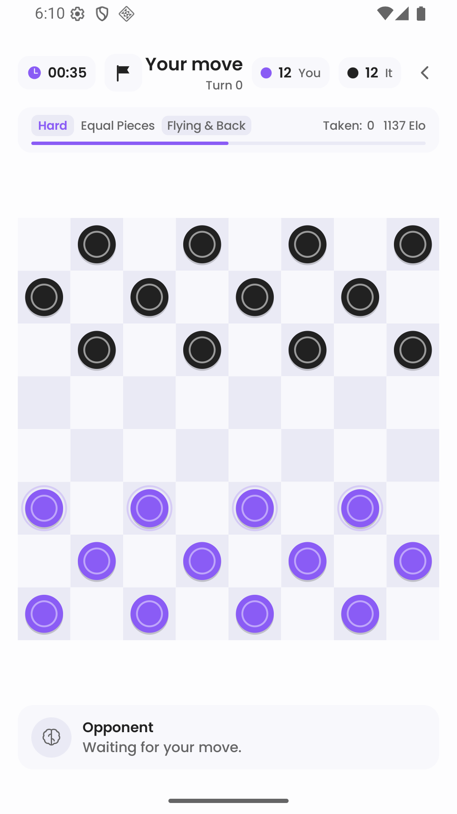
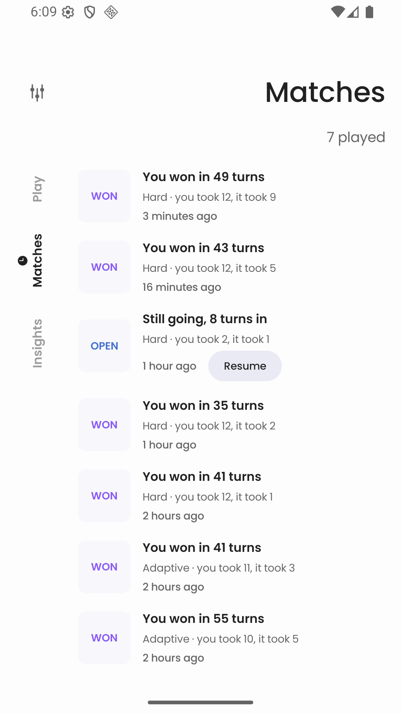
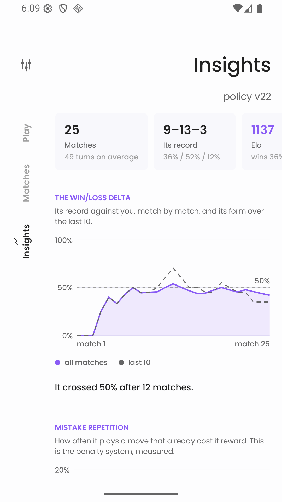
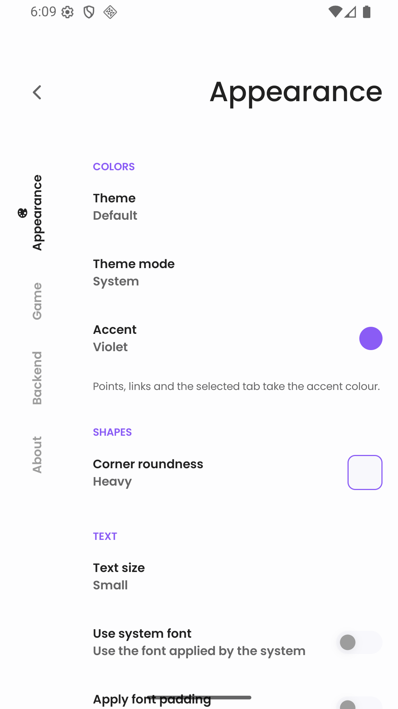
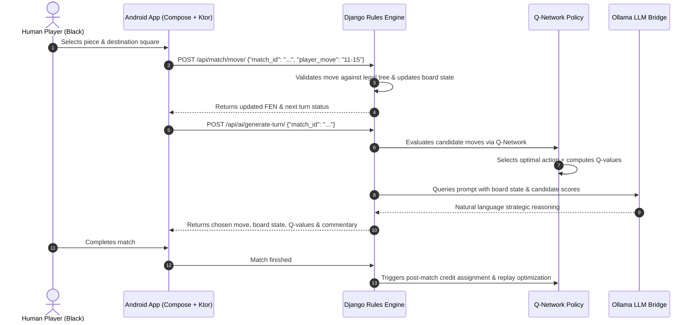

# 👑 CrownFoundry

<div align="center">


<br/>

**Adaptive AI Checkers** — English draughts on an Android client refereed by a Django backend with an online Reinforcement Learning engine and natural-language move narration.

[Features](#-key-features) •
[Architecture](#-architecture) •
[Screenshots](#-screenshots) •
[Quickstart](#-quickstart) •
[How the AI Learns](#-reinforcement-learning--ai) •
[API Contract](#-rest-api) •
[Testing](#-testing--verification)

</div>

---

## 📖 Overview

**You play. It loses. It works out why, and the next game is harder.**

CrownFoundry pairs an Android client crafted in Jetpack Compose with a Django backend that serves as both strict referee and continuous reinforcement-learning gym. Every move made in every game feeds into a Q-learning replay buffer, adjusting policy weights so the AI learns your tactical habits in real time.

When the opponent moves, an integrated local LLM bridge (via **Ollama**) translates the Q-network's evaluation and board dynamics into live, in-character natural language commentary.

---

## 📱 Screenshots

<div align="center">
  <table>
    <tr>
      <td align="center" width="33%">
        <br />
        <b>Play Dashboard & Match Setup</b><br />
        <i>Difficulty selector, opponent Elo & policy version</i>
      </td>
      <td align="center" width="33%">
        <br />
        <b>Interactive Draughts Board</b><br />
        <i>Legal move hints, turn indicators & custom pieces</i>
      </td>
      <td align="center" width="33%">
        <br />
        <b>Live AI Reasoning & Evaluation</b><br />
        <i>Ollama natural language narrative + Q-values</i>
      </td>
    </tr>
    <tr>
      <td align="center" width="33%">
        <br />
        <b>Match History & Replays</b><br />
        <i>Timeline of games with turn breakdown</i>
      </td>
      <td align="center" width="33%">
        <br />
        <b>Learning Curve Analytics</b><br />
        <i>Win rates, Elo progress & mistake reduction</i>
      </td>
      <td align="center" width="33%">
        <br />
        <b>Settings & Appearance</b><br />
        <i>Rule customization, backend endpoint & themes</i>
      </td>
    </tr>
  </table>
</div>

---

## ✨ Key Features

- **Strict English Draughts Rules Referee**: Complete implementation of standard 8x8 checkers rules (compulsory capture, multi-jumps, crowned-mid-jump rule termination) built in pure Python with zero external dependencies.
- **Continuous Reinforcement Learning**:
  - **Online Updates**: Every AI turn updates replay memory and executes a gradient step.
  - **Post-Match Credit Assignment**: Replays completed matches to backpropagate terminal rewards (+10 Win, -10 Loss, +3 Crown, +2 Capture, -2 Lost Man).
  - **Self-Play Training**: Headless self-play engine (`python manage.py train_selfplay`) for offline policy bootstrapping and evaluation.
- **Adaptive Opponent Profiling**: Dynamically tracks player aggression, king-rush tendencies, and capture rates to customize search depth and exploration.
- **Natural Language Move Commentary**: Bridges to a local **Ollama** LLM instance (e.g. `qwen3.5:9b` or `llama3`) to explain strategic reasoning behind each chosen move; gracefully falls back to deterministic heuristic narratives if offline.
- **Bespoke Jetpack Compose UI**: Fast, fluid Android interface adapted from ViMusic's design system — custom fluid theming, animated piece hops and jump arcs, coronation effects, and zero boilerplate Material bloat.
- **Learning Curve HUD & Analytics**: Built-in visual insights tracking win-rate trajectories, mistake repetition rates, average game durations, and Q-network loss convergence.

---

## 🏗 Architecture

```
CrownFoundry/
├── Backend/                 # Django 6 + Django REST Framework Referee & ML Engine
│   ├── game/                # Rules referee (engine/), match models, REST views
│   │   └── engine/          # Pure Python rules implementation (zero Django imports)
│   ├── ai/                  # Q-network (NumPy), replay buffer, Ollama bridge, self-play
│   ├── analytics/           # ELO calculator, player profiling, learning metrics
│   └── crownfoundry/        # Project settings, routing, WSGI/ASGI
├── Mobile/                  # Native Android Client (Kotlin 2.1 + Jetpack Compose 1.7)
│   ├── app/                 # UI screens (Play, Game, Matches, Insights, Settings)
│   ├── api/                 # Ktor 2.3 HTTP client and serializable DTOs
│   ├── compose-routing/     # Modular screen navigation
│   └── compose-persist/     # Survives activity recreation & config changes
├── tools/                   # Validation & testing harness
│   ├── perft.py             # Combinatorial move-tree verification against settled draughts counts
│   └── e2e_smoke.py         # End-to-end API contract testing over real HTTP
├── APK/                     # Pre-built installable Android application package
└── ARCHITECTURE.md          # Shared contract & protocol specification
```

### System Interaction Diagram



---

## 🚀 Quickstart

### Prerequisites

- **Backend**: Python 3.11+ (with `pip` and `venv`)
- **Mobile**: Android Studio Ladybug / Koala or Android SDK command-line tools with Java 17+
- **LLM (Optional)**: [Ollama](https://ollama.com/) running locally with your model of choice (default: `qwen3.5:9b`)

---

### 1. Start the Backend

```bash
cd Backend

# Create and activate virtual environment
python3 -m venv .venv
source .venv/bin/activate

# Install dependencies
pip install -r requirements.txt

# Run migrations and start server
python manage.py migrate
python manage.py runserver 0.0.0.0:8000
```

Verify backend health:
```bash
curl http://127.0.0.1:8000/api/health/
# Returns: {"ok": true, "version": "1.0.0", "ollama": {"available": true, "model": "qwen3.5:9b"}, "policy_version": 22}
```

---

### 2. (Optional) Run Ollama for AI Move Commentary

If you want the AI to narrate its moves using a local LLM:

```bash
# Pull and run your preferred model
ollama run qwen3.5:9b
```

*Note: If Ollama is not running, CrownFoundry automatically falls back to heuristic commentary seamlessly.*

---

### 3. Run or Install the Mobile App

#### Option A: Install Prebuilt APK

You can install the provided build directly to a connected device or emulator:

```bash
adb install APK/CrownFoundry.apk
```

#### Option B: Build from Source

```bash
cd Mobile

# Build Debug APK
./gradlew :app:assembleDebug

# Install onto connected device / emulator
./gradlew :app:installDebug
```

> **Network Configuration**: In Android emulator, `http://10.0.2.2:8000` automatically routes to your host machine's `localhost:8000`. On a physical phone, navigate to **Settings** in the app and set the Backend URL to your host machine's LAN IP (e.g., `http://192.168.1.50:8000`).

---

## 🧠 Reinforcement Learning & AI

CrownFoundry uses an MLP Q-Network written with **NumPy** for zero-overhead, highly portable deployment without massive binary dependencies:

1. **Board Representation (Feature Vector)**:
   - 32 dark square encodings (Piece type: Empty, Human Man, Human King, AI Man, AI King).
   - Positional dynamics: back-rank safety, center control, piece advancements, king differential.
2. **Reward Function**:
   $$\text{Reward} = +10(\text{Win}) - 10(\text{Loss}) + 3(\text{Crown}) + 2(\text{Capture}) - 2(\text{Piece Lost})$$
3. **Continuous Policy Training**:
   - **Online**: Replay buffer push + Bellman gradient step on every turn.
   - **Post-Game**: Full-match replay to adjust losing lines and reinforce winning tactics.
   - **Self-Play Bootstrap**:
     ```bash
     cd Backend
     python manage.py train_selfplay --games 500 --evaluate 50
     ```

---

## 🌐 REST API

All API endpoints live under `/api/` and return standard JSON responses with `"ok": true|false`.

| Method | Endpoint | Description |
|---|---|---|
| `GET` | `/api/health/` | Health check, policy version, and Ollama status |
| `POST` | `/api/match/start/` | Start a new match with chosen difficulty & optional player UUID |
| `GET` | `/api/match/<uuid>/` | Fetch match state, history, board FEN, and legal moves |
| `POST` | `/api/match/move/` | Submit a human move (e.g. `{"player_move": "11-15"}`) |
| `POST` | `/api/ai/generate-turn/` | Request AI to select move, compute Q-values, and generate commentary |
| `GET` | `/api/matches/?player_id=<uuid>` | List match history with scores, turns, and outcomes |
| `POST` | `/api/match/<uuid>/resign/` | Concede the current game |
| `GET` | `/api/analytics/ai-performance/`| Fetch full learning-curve data, win-rates, and mistake series |
| `GET` | `/api/analytics/summary/` | Compact summary of AI performance and stats |

For complete payload structures and FEN specifications, see [`ARCHITECTURE.md`](./ARCHITECTURE.md).

---

## 🧪 Testing & Verification

### 1. Backend Unit & Regression Suite (360+ Tests)

```bash
cd Backend
.venv/bin/python manage.py test
```

### 2. Combinatorial Rules Verification (`perft`)

The rules engine is verified using `tools/perft.py` against standard English draughts combinatorics (7, 49, 302, 1469, 7361, 36768, 179740, 845931):

```bash
python tools/perft.py --depth 8
```

### 3. End-to-End API Integration Suite

```bash
# Requires Django server running on port 8000
python tools/e2e_smoke.py
```

### 4. Mobile Client Unit Tests

```bash
cd Mobile
./gradlew :api:testDebugUnitTest :app:testDebugUnitTest
```

---

## 📄 License

This project is licensed under the Apache License 2.0. See [`Mobile/LICENSE`](./Mobile/LICENSE) for details.
