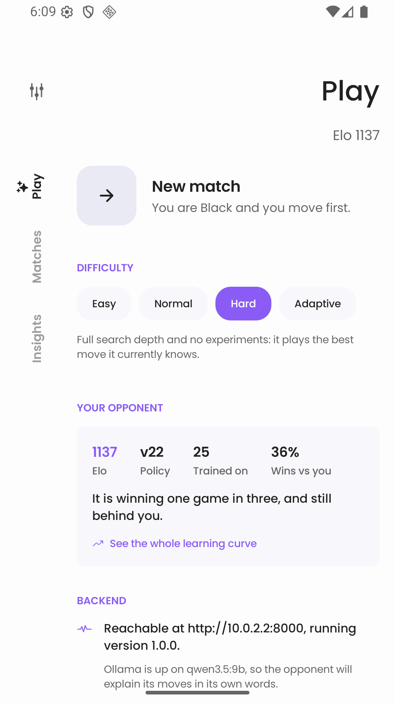
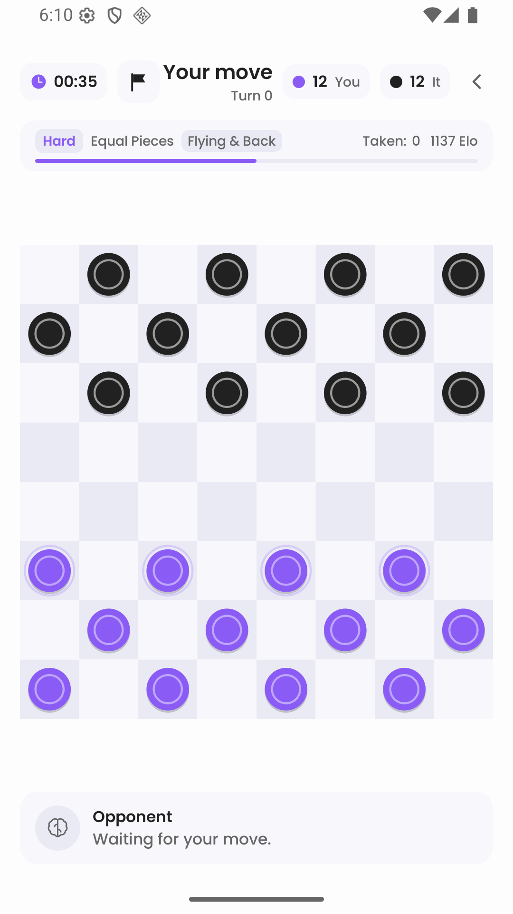
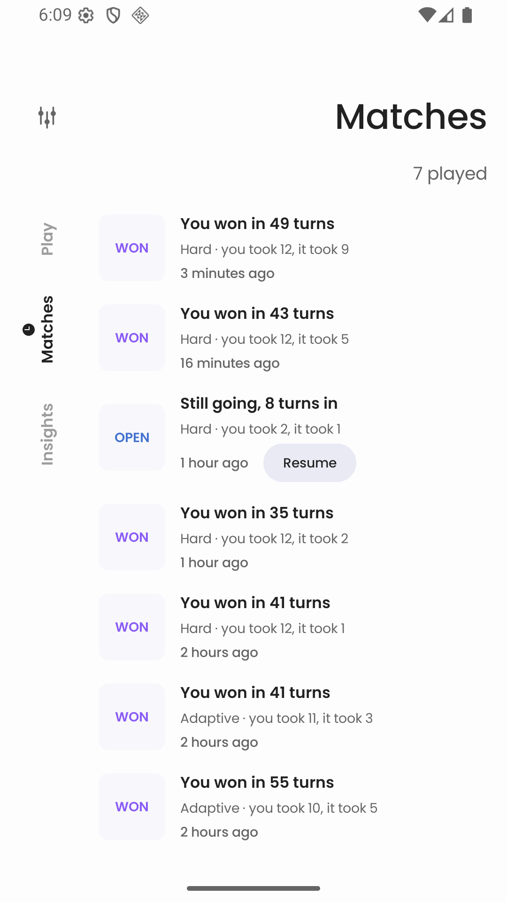
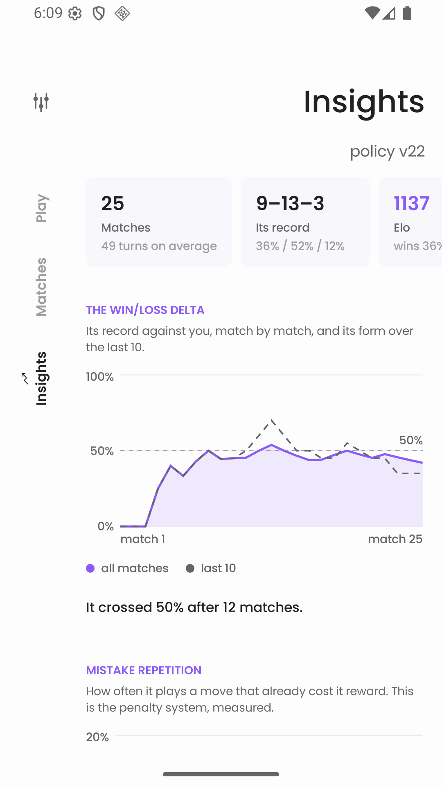
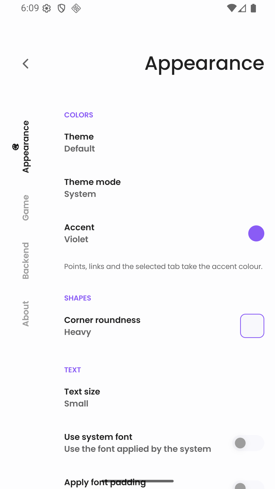
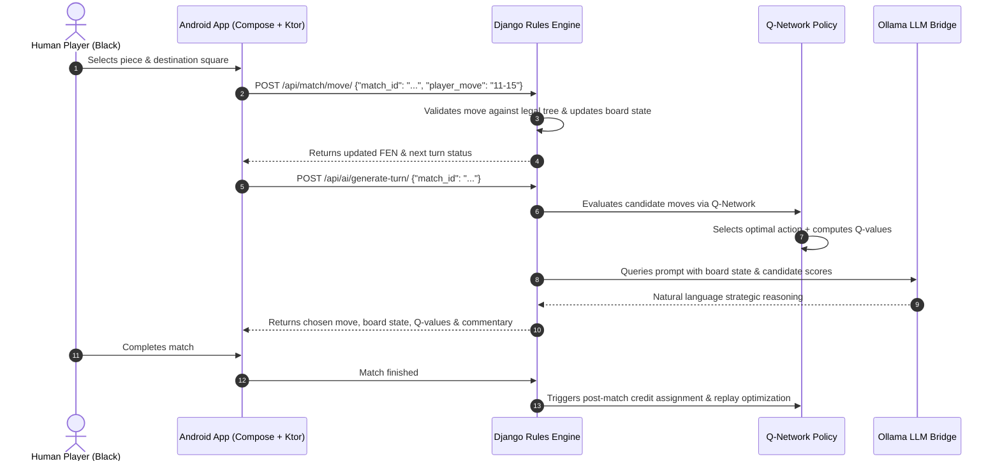
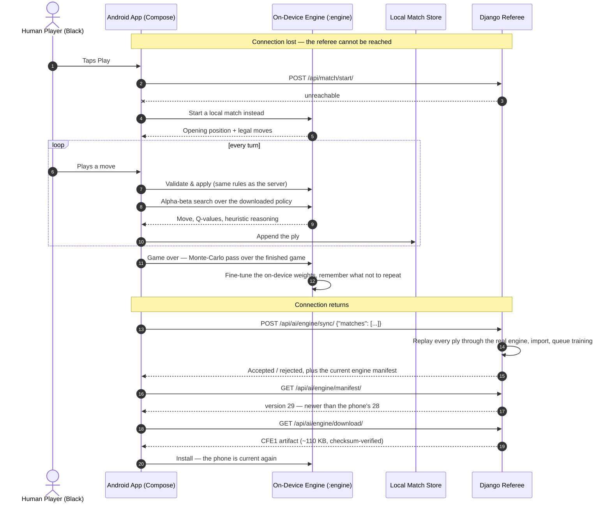

# 👑 CrownFoundry

<div align="center">


[](https://play.google.com/apps/testing/com.surenjanath.crownfoundry)

<br/>

**Adaptive AI Checkers** — English draughts against a reinforcement-learning opponent that runs entirely on your phone. An optional Django backend trains it further, referees online matches and narrates its moves through a local LLM.

[Get the app](#-get-the-app) •
[Features](#-key-features) •
[Architecture](#-architecture) •
[Screenshots](#-screenshots) •
[Quickstart](#-quickstart) •
[How the AI Learns](#-reinforcement-learning--ai) •
[API Contract](#-rest-api) •
[Testing](#-testing--verification)

</div>

---

## 📲 Get the app

CrownFoundry is on Google Play, in **closed testing** while it gathers feedback.

Nobody has to invite you — joining the testers group is what grants access:

1. **[Join the testers group](https://groups.google.com/g/ss-mobile-app-testing)** with the
   Google account you use on your Android phone. Nothing to fill in.
2. **[Opt in on Google Play](https://play.google.com/apps/testing/com.surenjanath.crownfoundry)**,
   tap *Become a tester*, and install.

Use the same Google account for both steps, or Play will not recognise you as a tester. The
[store page](https://play.google.com/store/apps/details?id=com.surenjanath.crownfoundry) only
opens once you have opted in — until then it shows "not found", which is how closed testing
works rather than a broken link.

Android 5.0 (API 21) or newer. Free, no account, no ads, and nothing to configure — the
trained opponent ships inside the app, so it plays at full strength with no connection.

No data leaves your phone unless you point the app at a server yourself.
See the [privacy policy](https://surenjanath.github.io/CrownFoundry/privacy.html).

---

## 📖 Overview

**You play. It loses. It works out why, and the next game is harder.**

CrownFoundry is an Android client crafted in Jetpack Compose, carrying a trained Q-network that referees and plays entirely on the device. Every move feeds a replay buffer and adjusts the policy weights, so the opponent learns your tactical habits as you play — with no server involved.

Point it at the Django backend and it gains more: a second referee that validates every move independently, a self-play gym that keeps training the shared policy between games, match history synced across devices, and the analytics behind the Insights tab. None of it is required to play.

When the opponent moves, an integrated local LLM bridge (via **Ollama**) translates the Q-network's evaluation and board dynamics into live, in-character natural language commentary.

---

## 📱 Screenshots

<div align="center">
  <table>
    <tr>
      <td align="center" width="33%">
        <br />
        <b>Play Dashboard & Match Setup</b><br />
        <i>Difficulty selector, opponent Elo & policy version</i>
      </td>
      <td align="center" width="33%">
        <br />
        <b>Interactive Draughts Board</b><br />
        <i>Legal move hints, turn indicators & custom pieces</i>
      </td>
      <td align="center" width="33%">
        <br />
        <b>Live AI Reasoning & Evaluation</b><br />
        <i>Ollama natural language narrative + Q-values</i>
      </td>
    </tr>
    <tr>
      <td align="center" width="33%">
        <br />
        <b>Match History & Replays</b><br />
        <i>Timeline of games with turn breakdown</i>
      </td>
      <td align="center" width="33%">
        <br />
        <b>Learning Curve Analytics</b><br />
        <i>Win rates, Elo progress & mistake reduction</i>
      </td>
      <td align="center" width="33%">
        <br />
        <b>Settings & Appearance</b><br />
        <i>Rule customization, backend endpoint & themes</i>
      </td>
    </tr>
  </table>
</div>

---

## ✨ Key Features

- **Strict English Draughts Rules Referee**: Complete implementation of standard 8x8 checkers rules (compulsory capture, multi-jumps, crowned-mid-jump rule termination) built in pure Python with zero external dependencies.
- **Continuous Reinforcement Learning**:
  - **Online Updates**: Every AI turn updates replay memory and executes a gradient step.
  - **Post-Match Credit Assignment**: Replays completed matches to backpropagate terminal rewards (+10 Win, -10 Loss, +3 Crown, +2 Capture, -2 Lost Man).
  - **Self-Play Training**: Headless self-play engine (`python manage.py train_selfplay`) for offline policy bootstrapping and evaluation.
- **True Offline Play**: The trained policy is *bundled in the APK* as a ~110 KB artifact and runs on the device — a full Kotlin port of the rules referee, the feature encoder, the Q-network and the alpha-beta search. Same weights, same depth, same node budget as the server, so the offline opponent is not a weaker one, and a fresh install is playable before it has ever seen a network. Pointed at a server it picks up newer policies as they are trained; if its copy has fallen behind it says **"AI engine needs updating"** and keeps playing with what it has.
- **It Learns Offline Too**: Finished offline games run the same Monte-Carlo credit assignment the backend runs, fine-tuning the on-device weights before the next game starts. Those games then sync back to the server, which replays every ply through the real engine, trains on them, and publishes a new policy the device picks up — so a week spent offline still feeds the shared opponent.
- **Post-Game Analysis**: Opening a finished match scores every ply against the on-device engine — an evaluation curve with the position you are looking at marked on it, a verdict under each move naming what was there instead, and the one move that decided the game. It runs on the phone, so it works with no connection; a device with no engine installed is told so in one line rather than left waiting.
- **Puzzles From Your Own Games**: The mistakes the analysis finds become practice positions — a real position you reached, with a move you could have played at the time. Revealing the answer is a dead end on purpose: it counts as an attempt and never as a solve.
- **PDN Export**: Any game shares out as Portable Draughts Notation, the format every other draughts program reads, so a match does not end its life inside this app.
- **Pass and Play**: Two players, one phone. The board turns to face whoever is to move once their opponent's move has finished animating. It is the one thing here that needs no engine at all, so it works on a device that has never been online — and nothing it produces reaches the trainer, the outbox, the opponent model or the engine's win rate.
- **Ask It What You Should Play**: The policy on the device is only ever pointed at beating you; pointed the other way it will tell you what it would play in your seat. The hint button asks it and draws the answer on the board — a ring on the piece, a dashed arrow to the square. It searches a ply deeper than the opponent plays at, with the risk bonus off, because a hint is advice rather than a personality. It runs on the device, so it costs nothing and works with no connection.
- **See What It Nearly Played**: Every AI turn comes back with the shortlist attached — every move it weighed and what it scored each one. "It played 24-19" is a fact; "it played 24-19 over 23-18 by four hundredths" is what tells you the position was close. The ranking is shown with the gap from its pick, because the raw scores only mean anything against each other in that one position.
- **Adaptive Opponent Profiling**: Dynamically tracks player aggression, king-rush tendencies, and capture rates to customize search depth and exploration.
- **Natural Language Move Commentary**: Bridges to a local **Ollama** LLM instance (e.g. `qwen3.5:9b` or `llama3`) to explain strategic reasoning behind each chosen move; gracefully falls back to deterministic heuristic narratives if offline.
- **Bespoke Jetpack Compose UI**: Fast, fluid Android interface adapted from ViMusic's design system — custom fluid theming, animated piece hops and jump arcs, coronation effects, and zero boilerplate Material bloat.
- **Learning Curve HUD & Analytics**: Built-in visual insights tracking win-rate trajectories, mistake repetition rates, average game durations, and Q-network loss convergence.

---

## 🏗 Architecture

```
CrownFoundry/
├── Backend/                 # Django 6 + Django REST Framework Referee & ML Engine
│   ├── game/                # Rules referee (engine/), match models, REST views
│   │   └── engine/          # Pure Python rules implementation (zero Django imports)
│   ├── ai/                  # Q-network (NumPy), replay buffer, Ollama bridge, self-play
│   │                        #   + export.py / views.py: the engine artifact the phone downloads
│   ├── analytics/           # ELO calculator, player profiling, learning metrics
│   └── crownfoundry/        # Project settings, routing, WSGI/ASGI
├── Mobile/                  # Native Android Client (Kotlin 2.1 + Jetpack Compose 1.7)
│   ├── app/                 # UI screens (Play, Game, Matches, Insights, Settings)
│   ├── api/                 # Ktor 2.3 HTTP client and serializable DTOs
│   ├── engine/              # The offline brain: rules, encoder, Q-network, search, learner
│   ├── compose-routing/     # Modular screen navigation
│   └── compose-persist/     # Survives activity recreation & config changes
├── tools/                   # Validation & testing harness
│   ├── perft.py             # Combinatorial move-tree verification against settled draughts counts
│   └── e2e_smoke.py         # End-to-end API contract testing over real HTTP
├── APK/                     # Pre-built installable Android application package
└── ARCHITECTURE.md          # Shared contract & protocol specification
```

### System Interaction Diagram


```mermaid
sequenceDiagram
    autonumber
    actor Human as Human Player (Black)
    participant Client as Android App (Compose + Ktor)
    participant Referee as Django Rules Engine
    participant RL as Q-Network Policy
    participant LLM as Ollama LLM Bridge

    Human->>Client: Selects piece & destination square
    Client->>Referee: POST /api/match/move/ {"match_id": "...", "player_move": "11-15"}
    Referee->>Referee: Validates move against legal tree & updates board state
    Referee-->>Client: Returns updated FEN & next turn status
    
    Client->>Referee: POST /api/ai/generate-turn/ {"match_id": "..."}
    Referee->>RL: Evaluates candidate moves via Q-Network
    RL->>RL: Selects optimal action + computes Q-values
    Referee->>LLM: Queries prompt with board state & candidate scores
    LLM-->>Referee: Natural language strategic reasoning
    Referee-->>Client: Returns chosen move, board state, Q-values & commentary
    
    Human->>Client: Completes match
    Client->>Referee: Match finished
    Referee->>RL: Triggers post-match credit assignment & replay optimization
```

### Offline Loop

With no connection the app referees itself. Everything the player sees is the same; what changes is
who is answering, and that the commentary comes from the heuristic narrator instead of Ollama.


```mermaid
sequenceDiagram
    autonumber
    actor Human as Human Player (Black)
    participant Client as Android App (Compose)
    participant Engine as On-Device Engine (:engine)
    participant Store as Local Match Store
    participant Server as Django Referee

    Note over Client,Server: Connection lost — the referee cannot be reached

    Human->>Client: Taps Play
    Client->>Server: POST /api/match/start/
    Server--xClient: unreachable
    Client->>Engine: Start a local match instead
    Engine-->>Client: Opening position + legal moves

    loop every turn
        Human->>Client: Plays a move
        Client->>Engine: Validate & apply (same rules as the server)
        Client->>Engine: Alpha-beta search over the downloaded policy
        Engine-->>Client: Move, Q-values, heuristic reasoning
        Client->>Store: Append the ply
    end

    Client->>Engine: Game over — Monte-Carlo pass over the finished game
    Engine->>Engine: Fine-tune the on-device weights, remember what not to repeat

    Note over Client,Server: Connection returns

    Client->>Server: POST /api/ai/engine/sync/ {"matches": [...]}
    Server->>Server: Replay every ply through the real engine, import, queue training
    Server-->>Client: Accepted / rejected, plus the current engine manifest
    Client->>Server: GET /api/ai/engine/manifest/
    Server-->>Client: version 29 — newer than the phone's 28
    Client->>Server: GET /api/ai/engine/download/
    Server-->>Client: CFE1 artifact (~110 KB, checksum-verified)
    Client->>Engine: Install — the phone is current again
```

---

## 🚀 Quickstart

> **You do not need any of this to play.** The published app is self-contained — this section is
> for running the backend and building from source.

### Prerequisites

- **Backend**: Python 3.11+ (with `pip` and `venv`)
- **Mobile**: Android Studio Ladybug / Koala or Android SDK command-line tools with Java 17+
- **LLM (Optional)**: [Ollama](https://ollama.com/) running locally with your model of choice (default: `qwen3.5:9b`)

---

### 1. Start the Backend

```bash
cd Backend

# Create and activate virtual environment
python3 -m venv .venv
source .venv/bin/activate

# Install dependencies
pip install -r requirements.txt

# Run migrations and start server
python manage.py migrate
python manage.py runserver 0.0.0.0:8000
```

Verify backend health:
```bash
curl http://127.0.0.1:8000/api/health/
# Returns: {"ok": true, "version": "1.0.0", "ollama": {"available": true, "model": "qwen3.5:9b"}, "policy_version": 22}
```

---

### 2. (Optional) Run Ollama for AI Move Commentary

If you want the AI to narrate its moves using a local LLM:

```bash
# Pull and run your preferred model
ollama run qwen3.5:9b
```

*Note: If Ollama is not running, CrownFoundry automatically falls back to heuristic commentary seamlessly.*

---

### 3. Run or Install the Mobile App

#### Option A: Install Prebuilt APK

You can install the provided build directly to a connected device or emulator:

```bash
adb install APK/CrownFoundry.apk
```

#### Option B: Build from Source

```bash
cd Mobile

# Build Debug APK
./gradlew :app:assembleDebug

# Install onto connected device / emulator
./gradlew :app:installDebug
```

> **Network Configuration**: In Android emulator, `http://10.0.2.2:8000` automatically routes to your host machine's `localhost:8000`. On a physical phone, navigate to **Settings** in the app and set the Backend URL to your host machine's LAN IP (e.g., `http://192.168.1.50:8000`).

---

## 🧠 Reinforcement Learning & AI

CrownFoundry uses an MLP Q-Network written with **NumPy** for zero-overhead, highly portable deployment without massive binary dependencies:

1. **Board Representation (Feature Vector)**:
   - 32 dark square encodings (Piece type: Empty, Human Man, Human King, AI Man, AI King).
   - Positional dynamics: back-rank safety, center control, piece advancements, king differential.
2. **Reward Function**:
   $$\text{Reward} = +10(\text{Win}) - 10(\text{Loss}) + 3(\text{Crown}) + 2(\text{Capture}) - 2(\text{Piece Lost})$$
3. **Continuous Policy Training**:
   - **Online**: Replay buffer push + Bellman gradient step on every turn.
   - **Post-Game**: Full-match replay to adjust losing lines and reinforce winning tactics.
   - **Self-Play Bootstrap**:
     ```bash
     cd Backend
     python manage.py train_selfplay --games 500 --evaluate 50
     ```

### Self-play on the phone

The device does not only learn from the games you sit through. **Settings → Offline → Train it
against itself** runs a practice session on the phone: the opponent plays a run of games against
random play, then against a material grabber, then against its own policy, collects every position
into a replay buffer, and fits the network once over the whole buffer at a tenth of the artifact's
learning rate.

Nothing it learns is installed until it has proved itself. The trained candidate plays a match
against the weights it would replace, from randomised openings, and is discarded unless it wins:

| Check | What it catches |
|---|---|
| Head-to-head vs. the previous weights, ≥55% over 20 games | The measurement that has no ceiling — this is what admits an improvement |
| Baseline vs. Random and Greedy, within 18 points of the champion's | A policy that learned to beat its own previous version by exploiting a blind spot they share |

Both have to pass. The baseline alone saturates — the shipped v42 policy already beats both fixed
opponents every game from the opening — so a guard built only on it can report a policy getting
worse and never one getting better.

Measured on the shipped policy, twelve sessions of 25 games (about ten seconds on a laptop, a
minute or so on a phone) accepted two and produced a policy that beat the one it started from
**25–13–2 over 40 varied games**. Most sessions are rejected, and that is the guard working rather
than failing: self-play produces a real improvement some of the time and noise the rest of it.

### Publishing a trained policy

A build with no referee (`crownfoundry.backendUrl=none`, which is what ships on Play) can still
update its opponent, by polling a static manifest instead of a server:

```bash
cd Backend

# The database is not committed, so on a fresh clone the exported artifact is the only surviving
# copy of the trained policy. Load it back before training on top of it.
python manage.py migrate
python manage.py import_engine --in ../Mobile/app/src/main/assets/policy.cfe

# Train. Continuing from a stored policy fine-tunes it: a tenth of its own learning rate, and one
# fitting phase over the replay buffer once the games have been played, rather than fitting each
# game as it arrives. See --lr-scale and --fit-steps, and the note below on why.
python manage.py train_selfplay --games 500 --evaluate --eval-games 30 --report

# Export.
python manage.py export_engine --out ../docs/engine/policy.cfe

# Check it is actually better before publishing it. See the warning below - this is the step
# that decides, not `--evaluate`.
cd ../Mobile && ./gradlew :engine:testDebugUnitTest --tests '*ArtifactComparisonTest*' \
  --rerun-tasks \
  -Pcrownfoundry.champion=app/src/main/assets/policy.cfe \
  -Pcrownfoundry.candidate=../docs/engine/policy.cfe

# Publish, if it said PUBLISH.
cd .. && python tools/publish_engine.py docs/engine/policy.cfe

# Refresh what a *fresh install* starts with, before it has ever fetched an update.
cp docs/engine/policy.cfe Mobile/app/src/main/assets/policy.cfe

git add docs/engine Mobile/app/src/main/assets/policy.cfe
git commit -m "engine: publish v43" && git push
```

> [!IMPORTANT]
> **`--evaluate` can veto a run but it cannot confirm one.** `should_save` compares scores against a
> random and a greedy opponent, and it does catch a collapse — a 200-game run at the old defaults
> took v42 from beating the greedy baseline every game to beating it half the time, and the gate
> correctly threw it away.
>
> What it cannot do is resolve anything finer, or recognise an improvement at all. `ai.training.evaluate`
> plays every game from the opening position, so for two deterministic policies it is one game
> repeated; a policy strong enough to win it scores 1.000 before and 1.000 after, whatever happened
> in between. The shipped v42 beats both fixed opponents every game from the opening and only about
> 70% of the time from varied ones — that gap is the headroom the measurement throws away.
>
> So `--evaluate` is the floor, not the decision. `ArtifactComparisonTest` asks the question the way
> the device's own guard does — the two policies play *each other* directly, from randomised
> openings, alternating seats — which has no ceiling. Run it before every publish.

`docs/` is already served by GitHub Pages, so the push is the release. Build the app pointing at
the manifest and every install picks the new policy up on its own:

```bash
./gradlew :app:bundleRelease \
  -Pcrownfoundry.backendUrl=none \
  -Pcrownfoundry.engineManifestUrl=https://surenjanath.github.io/CrownFoundry/engine/manifest.json
```

The device verifies the size and the SHA-256 from the manifest before installing, refuses an
artifact format newer than it reads *before* spending the download on it, and writes through a
staging file — so a transfer killed halfway leaves the previous engine intact. Artifacts are
published under versioned names (`policy-v43.cfe`) so a device that reads the manifest and
downloads a minute later cannot find the bytes changed underneath it.

---

## 🏆 Leaderboards

Three boards, ranked through **Google Play Games**: games won, best win streak, and puzzles
solved. Everything is computed on the device from the local match corpus, and your own record is
shown on the Insights tab whether or not you are signed in.

Play Games is compiled in only when the build is given a Play Console app id — its SDK installs a
startup provider that throws if the manifest has no `APP_ID`, so it cannot be a dependency of a
build without one. Without these properties the build contains no Games code at all and the boards
simply do not appear.

**1. Create the Play Games project.** Play Console → *Play Games Services* → *Setup and management*
→ *Configuration* → **Create a new Play Games Services project**, and link it to the existing
`com.surenjanath.crownfoundry` app. The **Project ID** it gives you is the numeric app id — twelve
digits, no letters. That is `playGamesAppId`.

**2. Add the three leaderboards.** *Play Games Services* → *Leaderboards* → **Create leaderboard**,
three times. The IDs the console generates look like `CgkIxxxxxxxxxxEAQ`, and each one maps to a
`key` the app already uses:

| Console leaderboard | `key` | Score format | Ordering |
|---|---|---|---|
| Games won | `wins` | Integer | Larger is better |
| Best win streak | `streak` | Integer | Larger is better |
| Puzzles solved | `puzzles` | Integer | Larger is better |

The names are yours to choose; only the `key` on the left of each colon has to match, because that
is what `Leaderboard.key` looks itself up by.

**3. Add a credential.** *Play Games Services* → *Configuration* → *Credentials* → **Add
credential** → *Android*. It needs the SHA-1 of the certificate the app is signed with — for a Play
App Signing release that is the **app signing key** SHA-1 from *Setup → App integrity*, not your
upload key. Getting this wrong is the usual cause of a silent sign-in failure, which in this app
shows up as the boards never appearing rather than as an error.

**4. Fill in `Mobile/gradle.properties`** (the lines are already there, commented out):

```properties
crownfoundry.playGamesAppId=123456789012
crownfoundry.playGamesLeaderboards=wins:CgkI…,streak:CgkI…,puzzles:CgkI…
```

**5. Build.** `./gradlew :app:bundleRelease` — the properties above are picked up automatically.

**6. Publish the Games project.** Leaderboards stay invisible to everyone but your test accounts
until the Play Games Services project is published, which is a separate button from publishing the
app itself. Add your own account under *Testers* while you are checking it.

---

## 🌐 REST API

All API endpoints live under `/api/` and return standard JSON responses with `"ok": true|false`.

| Method | Endpoint | Description |
|---|---|---|
| `GET` | `/api/health/` | Health check, policy version, and Ollama status |
| `POST` | `/api/match/start/` | Start a new match with chosen difficulty & optional player UUID |
| `GET` | `/api/match/<uuid>/` | Fetch match state, history, board FEN, and legal moves |
| `POST` | `/api/match/move/` | Submit a human move (e.g. `{"player_move": "11-15"}`) |
| `POST` | `/api/ai/generate-turn/` | Request AI to select move, compute Q-values, and generate commentary |
| `GET` | `/api/matches/?player_id=<uuid>` | List match history with scores, turns, and outcomes |
| `POST` | `/api/match/<uuid>/resign/` | Concede the current game |
| `GET` | `/api/analytics/ai-performance/`| Fetch full learning-curve data, win-rates, and mistake series |
| `GET` | `/api/analytics/summary/` | Compact summary of AI performance and stats |
| `GET` | `/api/ai/engine/manifest/` | The current policy's version, architecture, size and checksum |
| `GET` | `/api/ai/engine/download/` | That policy as a `CFE1` artifact for on-device play (ETag-cached) |
| `POST` | `/api/ai/engine/sync/` | Upload games played offline; every ply is replayed before import |

For complete payload structures and FEN specifications, see [`ARCHITECTURE.md`](./ARCHITECTURE.md).

---

## 🧪 Testing & Verification

### 1. Backend Unit & Regression Suite (394 Tests)

```bash
cd Backend
.venv/bin/python manage.py test
```

### 2. Combinatorial Rules Verification (`perft`)

The rules engine is verified using `tools/perft.py` against standard English draughts combinatorics (7, 49, 302, 1469, 7361, 36768, 179740, 845931):

```bash
python tools/perft.py --depth 8
```

### 3. End-to-End API Integration Suite

```bash
# Requires Django server running on port 8000
python tools/e2e_smoke.py
```

### 4. Mobile Client Unit Tests (394 Tests)

```bash
cd Mobile
./gradlew testDebugUnitTest
```

### 5. Cross-Language Engine Verification

The offline engine is a port, so it is tested against the original rather than against itself: perft
counts to depth 5 for both rule variants, every feature scalar from both perspectives, and a real
trained network exported by `ai.export` whose numpy outputs the Kotlin forward pass has to reproduce.

```bash
cd Mobile
./gradlew :engine:testDebugUnitTest --tests "*ArtifactTest" --tests "*FeaturesTest" --tests "*BoardTest"

# What a turn actually costs, printed rather than asserted:
./gradlew :engine:testDebugUnitTest --tests "*SearchBudgetTest" -i | grep -E "search:|forward pass:"
```

---

## 📄 License

This project is licensed under the Apache License 2.0. See [`Mobile/LICENSE`](./Mobile/LICENSE) for details.
